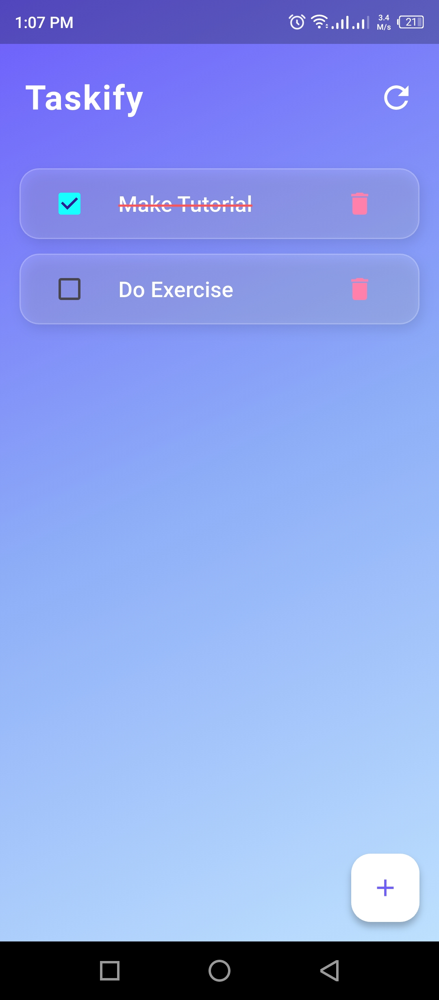
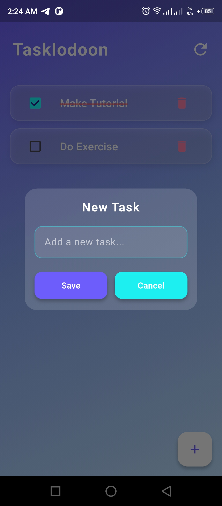

# ✨ Tasklodoon - Beautiful Flutter To-Do App

Taskify is a simple, elegant, and colorful **To-Do list** app built with Flutter.  
Designed to be lightweight, fast, and visually appealing, it helps you keep track of your daily tasks effortlessly.

---

## 🌟 Features

✅ Add new tasks with a stylish dialog box  
✅ Check off completed tasks – they get a **red strike-through**  
✅ Delete individual tasks with a single tap  
✅ Clear all tasks with a refresh icon (only if tasks exist)  
✅ Animated UI: smooth text style transitions when tasks are marked complete  
✅ Glassy cards & modern gradient background for a fresh look  
✅ Fully responsive UI with modern color palette  

---

## 🖼️ Screenshots

| Home Screen | New Task Dialog |
|------------|-----------------|
|  |  |


---

## 🛠️ Tech Stack

- **Flutter** – UI toolkit
- **Hive** – Local key-value database for task storage
- **Dart** – Programming language
- Custom Widgets & Animated Styles

---

## 📦 Installation & Setup

Make sure you have Flutter installed.  
If not, check: [flutter.dev/docs/get-started/install](https://flutter.dev/docs/get-started/install)

```bash
# Clone the repository
git clone https://github.com/yourusername/taskify.git

# Navigate into the project folder
cd tasklodoon

# Install dependencies
flutter pub get

# Run the app
flutter run
